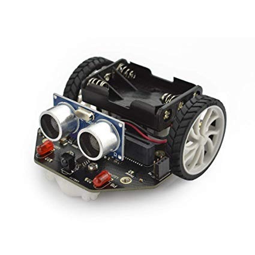

# Introducción  la Robótica con micro:bit

## CEP de Guadix

### 7,14, 21, 28 noviembre de 2019

## José Antonio Vacas @javacasm

## https://github.com/javacasm/RoboticaGuadix

Este curso ofrece al profesorado conocer y utilizar nuevas herramientas para incorporarlas al aula: la programación y la robótica. Podrá conocer diferentes tipos de robot y trabajar con la placa micro:bit dentro del aula, además de familiarizarse con un primer lenguaje de programación de fácil uso a través de bloques gráficos.

## Objetivos

- Conocer las posibilidades de la programación y la robótica en la práctica docente.
- Mostrar al profesorado las ventajas del uso herramientas tales como la programación y la robótica.
- Dar a conocer diferentes tipos de robot y familiarizarse con la placa micro:bit y algunos complementos como la plataforma Maqueen micro:bit.

## Contenidos

0. [Índice](./Indice.md)
1. [Introducción a la robótica](./IniciacionRobotica.md). 
    La placa [micro:bit](./microbit.md).
    [Tutorial de uso](./tutorial.md) 
    Haciendo [Steam con micro:bit](./STEM.md)
2. Robótica sencilla con la plataforma [Maqueen micro:bit](./MaQueen.md)
3. Ejemplos de algunos proyectos sencillos
4. Exposición de proyectos realizados

# BBC [Micro:bit](./microbit.md)

# [Robot maqueen](./MaQueen.md)

[Recursos](./Recursos.md)

