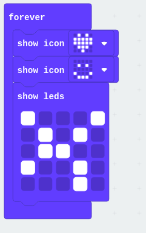
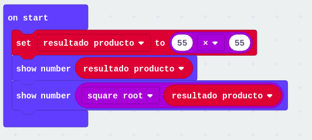
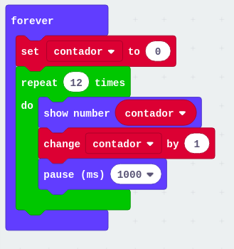
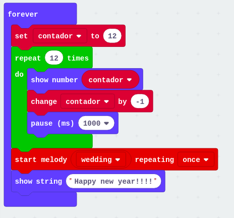

# Ejemplos

## Dibujos en los leds

[Ejemplo](https://makecode.microbit.org/_2umDKgXr687x)

## Cálculos sencillos

[Ejemplo](https://makecode.microbit.org/_L9iibr2646bF)

## Contando de 0 a 12

[Ejemplo](https://makecode.microbit.org/_avMERWV6DW3i)

## Contador de 12 a 0

[Ejemplo](https://makecode.microbit.org/_VaPMFeUmph3e)